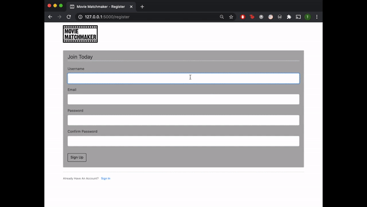

# Movie Matchmaker project

[](https://opensource.org/licenses/MIT)



Movie Matchmaker is an app that allows users to create an account and like or dislike movie cards from a database. Users can afterwards see a list of their liked and disliked movies,  as well as a list of recommended movies based on their preferences

## Installation & Usage

### Installation

* Fork and clone or download the repo.
* Open terminal
* Run `pipenv install` to install dependencies.
* Run `pipenv shell` to open virtual environment.
* Run `export FLASK_APP=run.py` to tell terminal which application to work with (Linux/MacOS/GitBash).
* Run `export FLASK_ENV=development` to tell terminal which environment to work in (Linux/MacOS/GitBash).

### Usage

* Run `flask run` to launch the flask application.

## Usage 

* Go to the welcome page and click the 'Sign Up' button.

* Enter your details and press 'Submit'. You will be redirected to the 'Login' page.

* Type in the email and password you used to sign up.

* On the Swipe page click the "Yes" or "No" buttons depending on whether you like the currently displayed movie or not.


## Technologies

* Figma
* HTML
* CSS
* Bootstrap
* Python
* Flask
* SQLite
* Pytest


## Process

The project started with deciding what the topic and aim of our application would be. This was followed by sketching a rough design and plan using Figma. We then allocated a time frame for each task outlined and logged our progress and remaining tasks.

After the planning and designing step, we worked individually on separate tasks. After completing our individual work, we worked together by mob programming to try and connect them. We used the remaining time to implement testing for both sides and correct bugs and add fixes.

Everytime a new functioning feature was completed, its branch was merged to the Development branch and pushed to the main git repository. At the end all final changes were merged with the master branch.

## Code Snippets

Method of fetching user data from the SQL database and providing users with a token to be able to access the app.

```Python
@app.route("/home")
def home():
    try:
        checkRecList = RecomendedList.query.get(1) # This basically should add id from the recomended list.
        mov_id = checkRecList.movie_id
        realMovInfo = Moviedata.query.get(mov_id)
                                                   # This uses the movie id to get the movie from Moviedata.
        mov_dic = {                                # This dicitonary will be used to render the movieinfo.
            id: realMovInfo.id,
            "title": realMovInfo.title,
            "poster": realMovInfo.poster_path,
            "rel": realMovInfo.release_date,
            "desc": realMovInfo.overview,
            "genre": realMovInfo.genre1,
        }
    except AttributeError:
        x = random.randint(0,90)
        realMovInfo = Moviedata.query.get(x)
        mov_dic = {                                # This dicitonary will be used to render the movieinfo.
            "id": realMovInfo.id,
            "title": realMovInfo.title,
            "poster": realMovInfo.poster_path,
            "rel": realMovInfo.release_date,
            "desc": realMovInfo.overview,
            "genre": realMovInfo.genre1,
        }
    return render_template('home.html', name=current_user.username,  
                                        movieTitle=mov_dic['title'], 
                                        movieImgURL=mov_dic['poster'], 
                                        movieReleaseDate=mov_dic['rel'], 
                                        movieBrief=mov_dic['desc'])
```

## Wins & Challenges

Wins | Challenges
------------ | -------------
Improved understanding of designing apps with Flask. | Cleaning data for the machine learning algorithm.
Successfully set up a machine learning algorithm. | Inserting data from CSV files into SQL databases.
Succesful implementation of authentication and authorisation. | Achieving a high coverage with the pytest testing.
Inserted an animation in the footer. | Displaying the recommended movies list.

## Features

* Ability to sign up and login to the app.
* Ability to predict user's taste in movies with the machinelearning algorithm.
* Ability to save liked and disliked movies in the database.

## Future Features

* A more visually-appealing styling.
* Responsive design for mobile users.
* Having a list of already watched movies.
* Redirecting users to movie trailers.

## Licence

* [MIT Licence](https://opensource.org/licenses/mit-license.php)

To visit the site click this link (coming soon).